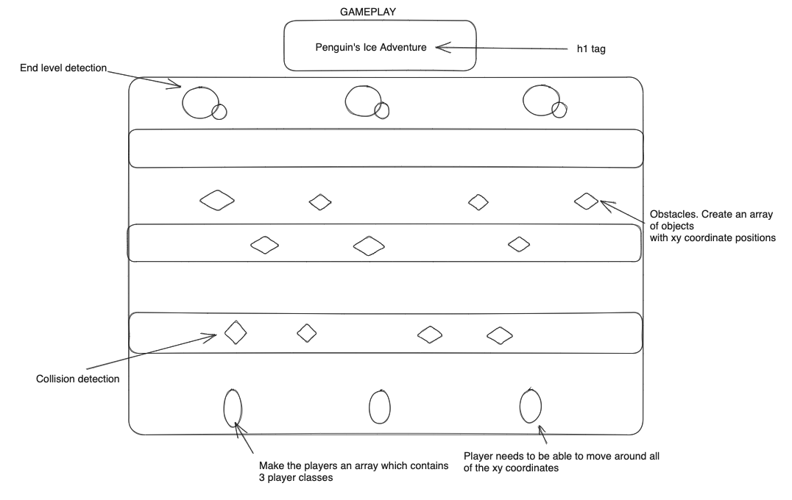
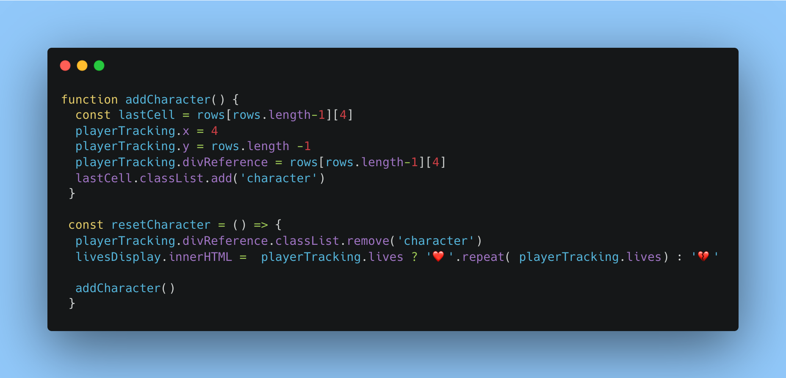
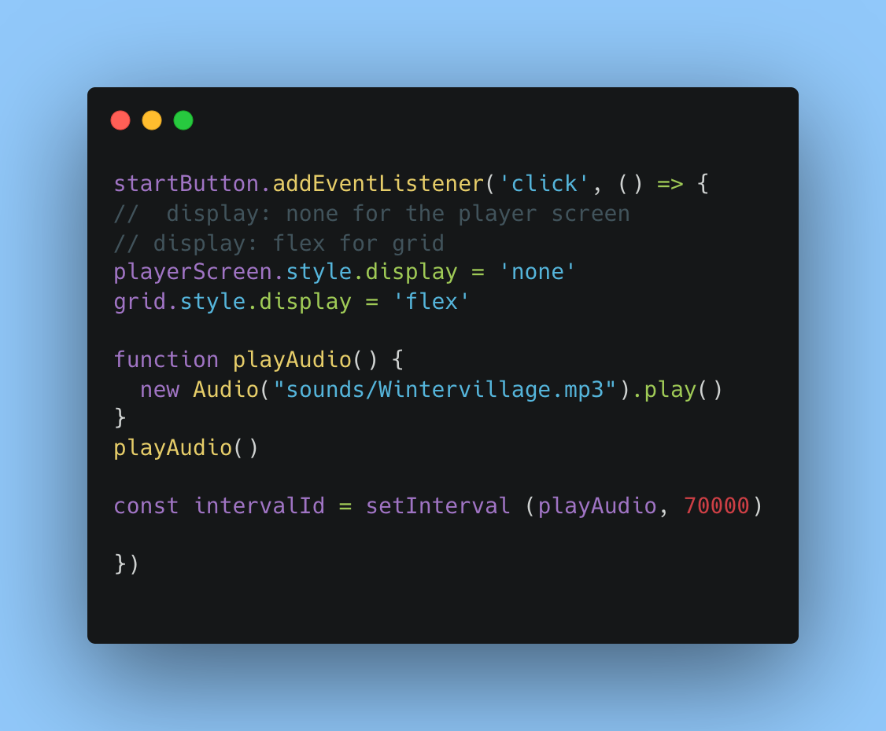
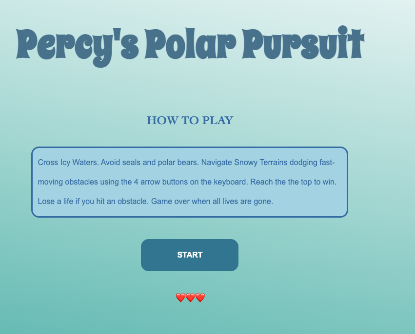
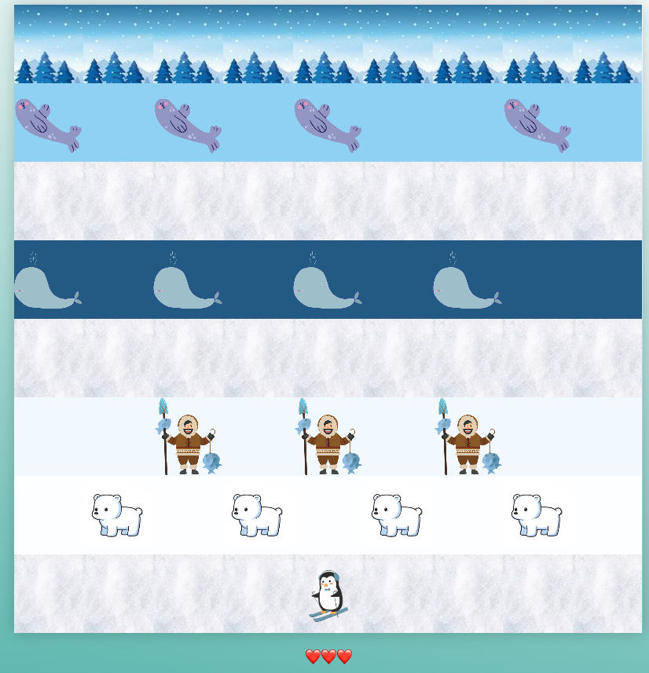
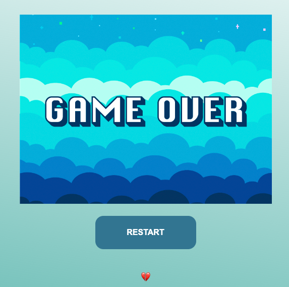
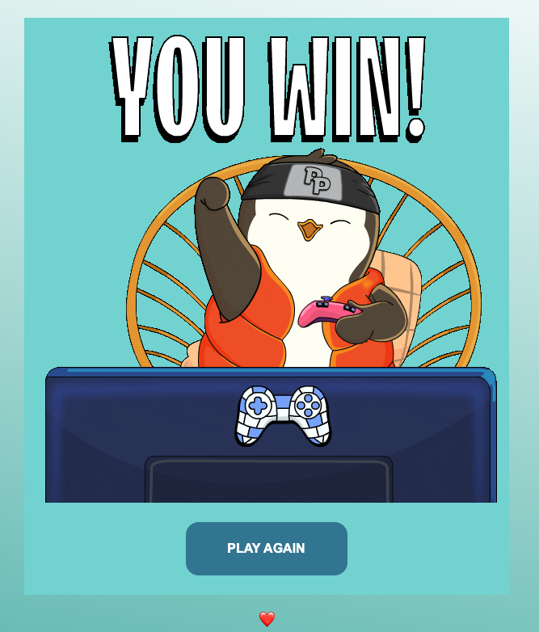

# Percy's Polar Pursuit 🐧

Welcome to "Percy's Polar Pursuit", a delightful twist on the classic Frogger game. Join Percy on his polar adventure as he navigates the treacherous icy paths and avoids various obstacles.

## Game Link:
[Percy's Polar Pursuit](https://kisalie.github.io/Percys-Polar-Pursuit/)

## How to Play 🎮

1. Use the arrow keys (↑, ↓, ←, →) to navigate Percy across the grid.
2. Avoid colliding with obstacles. You have 3 lives. If you lose all of them, it's game over!
3. Reach the top of the grid to win.

## Features ⭐

- Themed game environment with icy paths and moving obstacles.
- Engaging background music to keep you entertained.
- User-friendly start and restart options.
- Track lives with heart icons. Lose all hearts and face the game over screen!

## Technologies Used 💡

### HTML
- Header with the title of the game.
- Intro, win and game over screen with buttons.
- Adding lives.
### CSS
- Game grid styling using flexbox.
- CSS styling for the start, restart and play again buttons.
- Character styling.
### JavaScript
- Dynamic grid.
- The use of `setInterval` to move obstacles.
- Collision detection.

## My approach:
I started my project by firstly creating a basic wireframe to get an idea of what I wanted to include in my game. I then collected all the images, Gifs and background images I wanted to include in my project.

### My wireframe

Once I had a plan, I built a dynamic grid using JavaScript and I used CSS with a flexbox. Then I added the character and the `keydown eventListener` function to move the penguin around the grid.

I started off with adding one obstacle using `setInterval` to move it along the x-axis. Then it was refactored into a function to do multiple obstacles.

I made multiple buttons that allows the user to navigate properly between screens whilst also updating the state of the character back to its start position and updating lives.

### HomeScreen

The home screen contains the title and the instructions for the game as well as the start button.

## Gameplay

Once you click start:
- The backgroud music starts to play and it has a `setInterval` which allows the music to repeat.
- The character is able to move around the grid.
- There are 3 hearts at the bottom which shows the 3 lives.
- There is a collision detection function, that periodically checks whether both the players x and y coordinates are exactly the same as any of the obstacles.

### Game over

### You win

<!-- 
1. **DOM Manipulation**: You're making good use of DOM API methods to access and manipulate elements on the web page. You're able to select elements, modify their attributes, and add event listeners.
   
2. **Object-Oriented Approach**: You're using a playerTracking object to keep track of the player's state (position, lives, etc.). This approach helps in organizing the data and potentially extending functionalities in the future.

3. **Array Methods and Iteration**: There's a strong emphasis on the use of array methods such as `.push()`, `.map()`, and loops to iterate over elements and apply changes.

4. **Conditional Logic**: You effectively handle various game scenarios using conditional statements, such as collision detection and keyboard controls.

5. **Keyboard Event Handling**: You've implemented a keyboard event system to control the movement of the player. This showcases your understanding of event listeners and how to use them in interactive applications.

6. **CSS Styling**: You demonstrate an understanding of CSS styles, including complex properties like gradients, box shadows, and pseudo-elements.

7. **Timed Functions and Intervals**: The use of `setInterval()` to create repeating actions (like collision detection and obstacle movement) indicates your familiarity with asynchronous JavaScript and timing functions.

8. **Modular Functions**: Your code is organized into smaller, purpose-specific functions (like `generateGrid()`, `addCharacter()`, etc.), making it easier to read, debug, and extend.

9. **Game Logic Implementation**: You've successfully implemented fundamental game mechanics, such as collision detection and character movement.

10. **Responsive Design Elements**: The use of percentage-based widths and heights, as seen in your cell styling, indicates an understanding of responsive design principles.

11. **Audio Integration**: By integrating audio and controlling its playback, you've added an extra layer of interactivity to your game.

12. **Comments**: Your code is sprinkled with comments, which can be useful for others (and your future self) to understand the purpose and function of certain blocks of code.

Areas of Improvement:

1. **Separation of Concerns**: Ideally, it would be good to separate the JavaScript, CSS, and HTML into separate files for clarity and maintainability.
   
2. **Refactoring**: Some of the logic can be refactored for efficiency. For instance, the multiple `map()` functions that style rows could potentially be condensed.

3. **Use of Constants**: For values that do not change, such as '100', '800px' (grid dimensions), or keyboard key codes, it's a good practice to define them as constants at the top of your script.

4. **Code Comments**: While there are comments in the code, adding more detailed explanations or segmenting the code with larger comment headers can help improve clarity.

In conclusion, your code showcases a solid understanding of JavaScript game development, DOM manipulation, and CSS styling. With continued practice and potentially diving deeper into game frameworks or libraries, you can further refine your skills. Great work!

# Percys-Polar-Pursuit -->

<!-- 
### Step-by-Step Guide:

1. **Initialization**:
   - Initialize your game variables such as the player position, direction, speed, and any other essential data points.
   - Define any constant values, such as grid dimensions or key codes.

2. **Grid Generation**:
   - Calculate the total number of cells required based on your desired grid dimensions (e.g., 10x10 would be 100 cells).
   - Use a loop to iterate over each row and column:
     - For each iteration, create a `div` element which will represent an individual cell.
     - Assign relevant classes to these cells for styling and identification.
     - Append each cell to the game container.

3. **Character Creation**:
   - Create a separate function (`addCharacter()`) to handle the addition of the character to the game grid.
   - Within this function:
     - Access the grid cell corresponding to the character's current position.
     - Create a `div` or another HTML element to represent the character.
     - Apply necessary styles or classes to this character element.
     - Insert the character element into the appropriate grid cell.

4. **Keyboard Controls**:
   - Add an event listener to the document that listens for `keydown` events.
   - Within the event handler:
     - Check the key code of the pressed key.
     - Update the player's direction or take an appropriate action based on the key pressed.

5. **Character Movement**:
   - Implement a function or mechanism to regularly update the character's position based on the direction and speed. This can be done using methods like `setInterval()`.
   - For each update:
     - Calculate the new position of the character.
     - Clear the character from its previous position on the grid.
     - Place the character in its new position on the grid.

6. **Collision Detection**:
   - After every movement or at regular intervals, check if the character is in a position that intersects with an obstacle or boundary.
   - Implement necessary actions upon detecting a collision, such as stopping movement, reducing player lives, or ending the game.

7. **Audio Integration**:
   - Load necessary audio files at the start of the game or when the web page loads.
   - Integrate audio playback into various game events, such as movement or collision, to enhance the user experience.

8. **Styling and Visual Effects**:
   - Use CSS to define styles for the grid, cells, character, and any obstacles.
   - Implement animations, transitions, or visual effects as required, using CSS or JavaScript.

9. **Testing and Iteration**:
   - Play-test the game regularly to ensure that all mechanics are working as expected.
   - Refine and adjust the code as necessary based on the testing feedback.

By following these steps, you'll have a functional game with a grid-based system and a movable character. This structure serves as a foundation upon which you can add more complex features and mechanics as needed. -->

